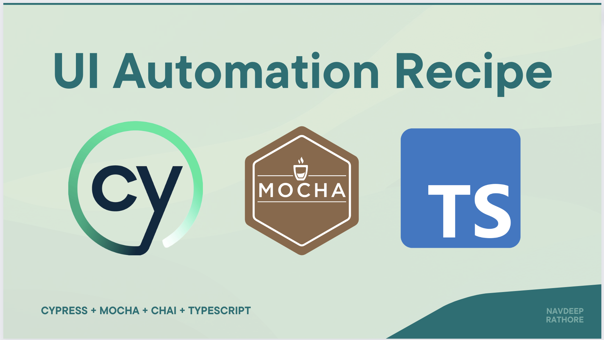

# UI Test Automation POC using Cypress, Mocha, and TypeScript



This repository contains a proof-of-concept (POC) for UI test automation using [Cypress](https://www.cypress.io/), [Mocha](https://mochajs.org/), and [TypeScript](https://www.typescriptlang.org/). The POC is designed to demonstrate the capabilities of Cypress and Mocha for UI test automation, as well as the benefits of using TypeScript for writing robust and maintainable tests.

## Prerequisites

Before running the tests, you need to have the following software installed on your machine:

- [Node.js](https://nodejs.org/en/) (version 12 or higher)
- [npm](https://www.npmjs.com/) (version 6 or higher)

## Installation

To install the dependencies, run the following command in the root directory of the project:

```
npm install
```

This will install Cypress, Mocha, TypeScript, and other dependencies required for running the tests.

## Configuration

Before running the tests, you need to configure Cypress to run your tests against your application. To do this, update the `baseUrl` property in the `cypress.config.ts` file with the URL of your application:

```json
{
  "baseUrl": "http://localhost:3000"
}
```

## Running the tests

To run the tests, run the following command in the root directory of the project:

```
npm run cy:run
```

This will launch Cypress and run all the tests in the `cypress/e2e` directory. You can also run individual test files or specific tests by specifying the file or test name in the command.

## Writing tests

Tests are written using TypeScript and Mocha syntax, and can be found in the `cypress/e2e` directory. Cypress provides a number of built-in commands for interacting with the browser, such as cy.visit() for navigating to a URL and cy.get() for selecting elements on the page.

Here's an example test that verifies the title of a page:

```ts
describe("Example test suite", () => {
  it("should have the correct title", () => {
    cy.visit("/");
    cy.title().should("equal", "My App");
  });
});
```

For more information on writing tests with Cypress and Mocha, refer to the [official documentation.](https://docs.cypress.io/guides/end-to-end-testing/writing-your-first-end-to-end-test)
